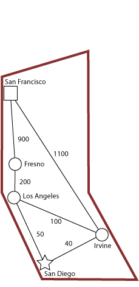

# A Star Search
## A Presentation and Demonstration of Concept
---

## Presentation

### Introduction

Dijkstra’s Algorithm is a search algorithm commonly used for finding the shortest path  between two points. The A * (A Star) algorithm is an implementation that improves upon Dijkstra’s original conception, while also considering the efficiency of the entire path. Applications of these algorithms include GPS navigation, routing protocols, and producing shortest-path spanning trees. These protocols are not appropriate for all types of problem and must be implemented carefully to avoid inefficiencies and confusion.

### History

Edsger W. Dijkstra was a Dutch computer scientist and professor who first came up with his famous pathfinding algorithm in 1956. Dijkstra’s Algorithm is a search algorithm for graph-based data structures, it solves the problem of finding the shortest distance between two points. It was developed to demonstrate the processing capacity of the ARMAC computer using transit maps of nearby Dutch cities.

    ARMAC: Automatische Rekenmachine van het Mathematisch Centrum 
    (Translated: Automatic Computing machine of the Mathematical Center).  
    Mathematical Center. Amsterdam, The Netherlands. 1956

### Dijkstra’s Algorithm

Dijkstra’s Algorithm operates in a graph-based data structure. It solves the problem of finding shortest paths from a source vertex to all other vertices in the graph. There are several constraints required for the algorithm to be successful: the graph points must be connected, the graph must be weighted, and all edges must have non-negative weights.  

---

**The algorithm itself is best displayed in pseudocode:** 

Purpose | Psuedocode
---|---
Define the starting points | s = 0
For all vertices inside the set of possible vertices (except starting point ) | for v1 in V (!s):
Set the distance of all elements to unknown	| v = ∞ 
Create an empty container of visited vertices | v2 = [ ]
Create queue of vertices to visit (all possible vertices) | q = [ ]
While the queue is not empty | While q.length != 0 : 
Select the element with the shortest distance | sort q by distance from s
Add q to list of visited vertices | v2.push (q[0])
Check all neighbors | For all v in neighbors of q :
If a new shortest path is found	| If v.dist > q.dist :
Overwrite previous shortest path | Then q = this.element
Return the distance from hop to new point | Return q.dist

---

### A * Search

Dijkstra’s Algorithm is considered a greedy search, as it does not consider the entire efficiency of the journey, only the next shortest path. A * uses Dijkstra’s Algorithm, while also considering the heuristic of overall distance. In this way A* improves upon the efficiency of Dijkstra’s Algorithm and allows for the use of modern powerful computers to increase the efficiency of operation. A * was initially developed by Peter Hart, Nils Nilsson and Bertram Raphael of the Stanford Research Institute to assist in pathing for Shakey the Robot, a very early self-driving prototype programmed in LISP andfunded by DARPA (Defense Advanced Research Projects Agency). 

    Shakey the Robot
    Stanford Research Institute. Menlo Park, CA. 
    1972

A * Search can be expressed as f(n) = g(n) + h(n) where g(n) = cost of traversing to point and h(n) = heuristic estimating cheapest cost of function. The added heuristic must be customized to the application and has several rules for its implementation. In this way A* Search can be fine tuned for maximum efficiency by controlling the precision requirements of the desired output. This also makes the time complexity and efficiency difficult to express mathematically using A * Search, because the exact numbers are dependent on the heuristic. 

## Demonstration

## Problem
---

Given the task of finding the path from one city to another, with the applied hueristic of shortest overall journey we can see different results depending on the use of Dijkstra’s or A*.

### Djikstra's Algorithm Solution
---

City | Distance | Total
---|---|---
Irvine | 40 | 40
Los Angeles | 100 | 140
Fresno | 200 | 340
San Francisco | 900 |1240
**Solution** | | **T1 = 1240** 

Dijkstra’s Algorithm will always return a path but it may not the optimal path, as it is a greedy search. A greedy search will always mathematically compare the weight of the next journey and choose the smallest number, with no concern for efficiency or time of processing.

### A* Evolution 1
---

City | Distance | Total | < T1 ?
---|---|---|---
Los Angeles | 50 | 50 | Y
Fresno | 200 | 250 | Y
San Francisco | 900 |1150 | Y
**Solution** | | **T2 = 1150** 

A* Search will run multiple iterations (including the original from the Dijkstra’s evolution) while retaining the overall shortest distance and attempting to beat it with each evolution until all options are exhausted.

### A* Evolution 2
---

City | Distance | Total | < T2 ?
---|---|---|---
Irvine | 40 | 40 | Y
San Francisco | 900 |1140 | Y
**Solution** | | **T3 = 1140** 

The final evolution of A* shows that it can efficiently find a path that Dijkstra’s missed, simply by using a very early example of machine learning to determine the desired outcome.

---

Dijkstra’s Algorithm can have some inherent inefficiencies in pathfinding problems; given specific conditions or real-world applications. In the below example Dijkstra’s Algorithm will search nearly infinitely in the same direction before considering the actual most efficient path.

### Summary

Improving upon Dijkstra’s original work allowed for implementation of the search algorithm in real world applications. Satellite GPS uses the principles of A *to remain as efficient as possible to save precious processing power of devices and reduce data manipulation costs. Dijkstra’s algorithm is the basis for many shortest path applications and helps solve many modern-day problems. Dijkstra’s algorithm is applied in network routing protocols, specifically OSPF (Open Shortest Path First) and IS-IS (Intermediate System to Intermediate System). Any maze solving or path finding algorithm can link its lineage to Dijkstra’s groundbreaking computer science concept.

#### References
- https://en.wikipedia.org/wiki/Dijkstra's_algorithm
- https://en.wikipedia.org/wiki/Edsger_W._Dijkstra
- https://en.wikipedia.org/wiki/A*_search_algorithm
- http://www-set.win.tue.nl/UnsungHeroes/machines/armac.html
- Computerphile: A * (A Star) Search Algorithm: https://www.youtube.com/watchv=ySN5Wnu88nE
- Computerphile: Dijkstra’s Algorithm: https://www.youtube.com/watch?v=GazC3A4OQTE
  
- Melissa Yan: MIT: Dijkstra’s Algorithm:
http://math.mit.edu/~rothvoss/18.304.3PM/Presentations/1-Melissa.pdf

#### Further Information

- Dijkstra’s Algorithm: Python Gist by econchick: https://gist.github.com/econchick/4666413

- Dijkstra’s Algorithm in Java by Florida Institute of Technology https://cs.fit.edu/~ryan/java/programs/graph/Dijkstra-java.html 

- Dijkstra’s Algorithm: C++ Gist by vertexclique: https://gist.github.com/vertexclique/7410577

- Rosetta Code: Dijkstra’s Algorithm: https://rosettacode.org/wiki/Dijkstra%27s_algorithm
  
#### Image Credits:
1.	http://www-set.win.tue.nl/UnsungHeroes/machines/armac.html
2.	https://en.wikipedia.org/wiki/Shakey_the_robot#/media/File:SRI_Shakey_with_callouts.jpg
