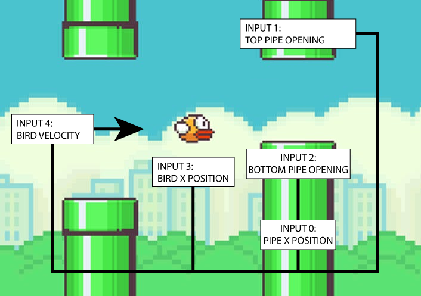

# 9.1 - FlapAI Bird

## Implementation of genetic algorithm and machine learning via toy neural network.

Genetic algorithm determines fitness of bird (distance / score) and increases the odds that birds will be selected by their fitness levels This does not mean the best bird always wins or that the population increases in fitness as it is random Fitness only increases the odds

Toy nueral network inputs:
```
      //x position of closest pipe
      inputs[0] = map(closest.x, this.x, width, 0, 1);
      //top of closest pipe opening
      inputs[1] = map(closest.top, 0, height, 0, 1);
      //bottom of closest pipe opening
      inputs[2] = map(closest.bottom, 0, height, 0, 1);
      //bird's y position
      inputs[3] = map(this.y, 0, height, 0, 1);
      //bird's y velocity
      inputs[4] = map(this.velocity, -5, 5, 0, 1); 
```
Input Demonstration


```
    P5.js
    Javascript
    Toy Nueral Network and Matrix
```
All Credit - Coding Train: Coding Challenge #31 https://www.youtube.com/watch?v=cXgA1d_E-jY