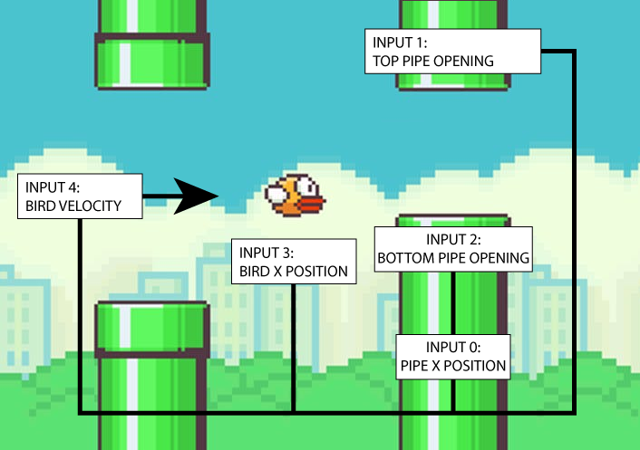

# Coding Challenges
## [https://batimusprime.github.io/codingchallenges/](https://batimusprime.github.io/codingchallenges/)
## This collection of coding challenges is a demonstration of skills and concepts


----

## 1.0: Fizz-Buzz
Classic implementation of Fizz Buzz

Planned solutions in as many languages as possible

+   Python
+   VBA Script
+   JavaScript

Code Repository: [1.0 - Fizz-Buzz](/1_Fizz_Buzz)

---

### 1.1: Fizz-Buzz Extended
Further demonstration of concept with added visualization

Records number of blue box, green box, and total number of clicks

Tests, blue, green, and total clicks

Notifies when total clicks are multiple of 10

+   JavaScript

Code Repository: [1.1 - Fizz-Buzz Extended](1_Fizz_Buzz/1_1_Fizz_Buzz_Extended)

Live Demonstration: [1.1 - Fizz-Buzz Extended](https://batimusprime.github.io/codingchallenges/1_Fizz_Buzz/1_1_Fizz_Buzz_Extended/)

---

---


## 2.0: Travelling Salesperson
Algorithmic challenge:

>*"Given a list of cities and the distances between each pair of cities, what is the shortest possible route that visits each city and returns to the origin city?"*

More info: [Wikipedia - Travelling salesperson problem](https://en.wikipedia.org/wiki/Travelling_salesman_problem)

+   JavaScript

Code Repository: [2.0 - Travelling Salesperson](2_Travelling_Sales)

Live Demonstration: [2.0 - Travelling Salesperson](https://batimusprime.github.io/codingchallenges/2_Travelling_Sales/)

---

---

## 3.0 A-Star / Dijkstra's Algorithm

Blog entry comparing A* and Djikstra's Algorithm

More info: [Wikipedia - Dijkstra's Algorithm](https://en.wikipedia.org/wiki/Dijkstra%27s_algorithm)

More Info: [Wikipedia - A* Search Algorithm](https://en.wikipedia.org/wiki/A*_search_algorithm)

More Info: [Youtube- Computerphile - A* (A-Star) Search](https://youtu.be/ySN5Wnu88nE)

+   Markdown

Code Repository: [3.0 - A-Star / Dijkstra's Algorithm](3_A_Star)

---

---

## 4.0 Plinko
Testing matter.js, basic physics engine present

+   JavaScript

Code Repository: [4.0 - Plinko](4_Plinko)

Live Demonstration:  [4.0 - Plinko](https://batimusprime.github.io/codingchallenges/4_Plinko/)


---

---

## 5.0 Fenway Scoreboard
Built from scratch as a means to display baseball scores silently. Click to interact with cells

+   JavaScript / jQuery
+   Python

Code Repository: [5.0 - Fenway Scoreboard Simulator](5_Fenway_Scoreboard)

Hosted at: [https://fenwayscoreboardsim.web.app/](https://fenwayscoreboardsim.web.app/)

---

---

### 6.0 - Firebase Wrapper
Demonstrates CRUD functions for Firebase datastore
    - Create
    - Read
    - Update
    - Delete
    - 
+ Javascript

Code Repository: [6.0 - Firebase Wrapper](6_Firebase_Wrapper)

Live Demonstration: [6.0 - Firebase Wrapper](https://batimusprime.github.io/codingchallenges/6_Firebase_Wrapper)

---

---

## 7.0 - Trivia Time
Non-working "The Office" themed trivia game

+ Javascript

Code Repository: [7.0 - Trivia Time](7_Trivia_Time)

Live Demonstration: [7.0 - Trivia Time](https://batimusprime.github.io/codingchallenges/7_Trivia_Time)

---

---

## 8.0 - NRCS API
Natural Resources Conservation Service Visualization API
Allows user to view historical SWE (Snow-Water Equivalent) data for all stations and basins in California. 
Data is automatically displayed in a graph using Chart.JS

+ Javascript
+ Python

Code Repository: [8.0 - NRCS API](8_NRCS_API)

Hosted at: [https://nrcsgraphs.web.app/](https://nrcsgraphs.web.app/)

---

---

## 9.0 - Flappy Bird
Use UP ARROW to fly.

Clone of Android game, going to be used to implement a simple nueral network and genetic algorithm. 

Coding Train: Coding Challenge #31 [https://www.youtube.com/watch?v=cXgA1d_E-jY]([https://www.youtube.com/watch?v=cXgA1d_E-jY])
+ Using P5.js
+ Javascript


Code Repository: [9.0 - Flappy Bird](9_Flappy_Bird)

Live Demonstration: [9.0 - Flappy Bird](https://batimusprime.github.io/codingchallenges/9_Flappy_Bird)

---

---

## 9.1 - FlapAI Bird

Implementation of genetic algorithm and machine learning via toy neural network.

Genetic algorithm determines fitness of bird (distance / score) and increases the odds that birds will be selected by their fitness levels
This does not mean the best bird always wins or that the population increases in fitness as it is random
Fitness only increases the odds

Toy nueral network inputs:
```js
      //x position of closest pipe
      inputs[0] = map(closest.x, this.x, width, 0, 1);
      //top of closest pipe opening
      inputs[1] = map(closest.top, 0, height, 0, 1);
      //bottom of closest pipe opening
      inputs[2] = map(closest.bottom, 0, height, 0, 1);
      //bird's y position
      inputs[3] = map(this.y, 0, height, 0, 1);
      //bird's y velocity
      inputs[4] = map(this.velocity, -5, 5, 0, 1); 
```


Coding Train: Coding Challenge #31 [https://www.youtube.com/watch?v=cXgA1d_E-jY]([https://www.youtube.com/watch?v=cXgA1d_E-jY])
+ P5.js
+ Javascript
+ Toy Nueral Network and Matrix

Code Repository: [9.1 - FlapAI Bird](9_Flappy_Bird/9_1_FlapAI_Bird)

Live Demonstration: [9.1 - FlapAI Bird](https://batimusprime.github.io/codingchallenges/9_Flappy_Bird/9_1_FlapAI_Bird)

---

---
